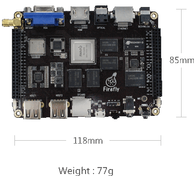

# Technical Reference Manual

## 1 Description
This manual is for the development of linux on RK3288 board.

### 1.1 Overview

### 1.2 Parameter
<table>
    <tr>
        <td class="dimen_left">Soc</td>
        <td class="dimen_right"><p>Rockchip RK3288 (28nm HKMG Process）</p></td>
    </tr>
    <tr>
        <td class="dimen_left">CPU </td>
        <td class="dimen_right">ARM® Cortex™-A17 Quad-Core up to 1.8GHz</td>
    </tr>
    <tr>
        <td class="dimen_left dimen_left_top">GPU</td>
        <td class="dimen_right ">
            <p>ARM® Mali-T760 MP4 Support OpenGL ES 1.1/2.0 /3.0, </p>
            <p>OpenVG1.1, OpenCL, Directx11</p>
            <p>Embedded high performance 2D hardware</p>
            <p>Supports H.264 10bits and H.265 4K video decoding, 1080P </p>
            <p>multi format video decoding</p>
            <p>1080P video encoding, supports H.264, VP8 and MVC</p>
        </td>
    </tr>
    <tr>
        <td class="dimen_left">RAM</td>
        <td class="dimen_right">2GB Dual-Channel DDR3 (Plus version is 4GB)</td>
    </tr>
    <tr>
        <td class="dimen_left">Storage</td>
        <td class="dimen_right">
            <p>16GB eMMC (Plus version is 32GB)</p>
            <p>MicroSD (TF) Card Slot</p>
        </td>
    </tr>
    <tr>
        <td class="dimen_left">PMU</td>
        <td class="dimen_right">ACT8846 PMU Chip</td>
    </tr>
    <tr>
        <td class="dimen_left dimen_left_top">Ethernet</td>
        <td class="dimen_right">
            <p>10/100/1000Mbps Ethernet (Realtek RTL8211E)</p>
        </td>
    </tr>
    <tr>
        <td class="dimen_left dimen_left_top">Wireless</td>
        <td class="dimen_right">
            <p>Integrated WiFi Combo Module ( AP6335 ) :</p>
            <p>WiFi 2.4GHz/5GHz Dual-Band Support 802.11a/b/g/n/ac</p>
            <p>Bluetooth 4.0 (Support BLE)</p>
        </td>
    </tr>
    <tr>
        <td class="dimen_left videoparam dimen_left_top">Display</td>
        <td class="dimen_right">
            <p>Supports multi-channel HD display:</p>
            <p>1 x HDMI 2.0，Support maximum 4K@60Hz display</p>
            <p>1 x VGA up to 1080P</p>
            <p>1 x MIPI、1 x EDP、2 x LVDS display interface (DSI) for LCD panels</p>
        </td>
    </tr>
    <tr>
        <td class="dimen_left dimen_left_top">Audio</td>
        <td class="dimen_right">
            <p>1 x HDMI audio output</p>
            <p>1 x Analog audio (via 3.5mm Combo Audio Jack for audio input and </p>
            <p>ouput)</p>
            <p>1 x SPDIF for audio output</p>
            <p>1 x On-board Micphone for audio input</p>
            <p>1 x I2S for audio input and ouput</p>
        </td>
    </tr>
    <tr>
        <td class="dimen_left">Camera</td>
        <td class="dimen_right">
            <p>1 x MIPI-CSI Camera Interface （Maximum 13Mpixel）</p>
        </td>
    </tr>
    <tr>
        <td class="dimen_left">USB</td>
        <td class="dimen_right">
            <p>2 x USB2.0 HOST，1 x USB2.0 OTG</p>
            <p>Reserved 4 groups USB2.0 header in the back of board</p>
        </td>
    </tr>
    <tr>
        <td class="dimen_left">IR</td>
        <td class="dimen_right">1 x IR Receiver Module，Support self defined IR remote</td>
    </tr>
    <tr>
        <td class="dimen_left">LED</td>
        <td class="dimen_right">1 x Power Status LED (Blue) ，1 x User Defined LED (Green)</td>
    </tr>
    <tr>
        <td class="dimen_left">Button</td>
        <td class="dimen_right">1 x Reset button，1 x Power button，1 x Recover button</td>
    </tr>
    <tr>
        <td class="dimen_left">Debugging </td>
        <td class="dimen_right">1 x Serial Console，for debugging</td>
    </tr>
    <tr>
        <td class="dimen_left dimen_left_top">Reserved Interface</td>
        <td class="dimen_right">
            <p>84 Pins header:</p>
            <p>MIPI、MIPI-CSI、Dual LVDS、EDP、PWM、SPI、</p>
            <p>UART、ADC、GPIO、I2C、I2S </p>
        </td>
    </tr>
    <tr>
        <td class="dimen_left">Power</td>
        <td class="dimen_right">DC5V - 2.5A ( via DC 4.0*1.7mm Jack )</td>
    </tr>
    <tr>
        <td class="dimen_left">OS</td>
        <td class="dimen_right">Android 4.4、5.1 /  Ubuntu 14.04</td>
    </tr>
    <tr>
        <td class="dimen_left">Size</td>
        <td class="dimen_right">118mm × 85mm</td>
    <tr>
        <td class="dimen_left lastparam">Weight</td>
        <td class="dimen_right lastparam">77g</td>
    </tr>
</table>

## 2 Make boot image
### 2.1 Install compiler for kernel

```
$tar -xvf tools/arm-eabi-4.8.tar.gz
$mv arm-eabi-4.8/ /opt/
$echo "export PATH=$PATH:/opt/arm-eabi-4.8/bin" >> ~/.bashrc
$source ~/.bashrc
```
### 2.2 Install dependence
```
$sudo apt-get install lib32ncurses5 lib32z1 lib32stdc++6 libssl-dev
```

### 2.3 Install mkbootimg
```
$cd tools/rockchip-mkbootimg
$make
$sudo make install
```
### 2.4. Build kernel
```
$cd linux-kernel-4.4/linux-kernel
$export ARCH=arm
$export CROSS_COMPILE=arm-eabi-
$make rockchip_linux_defconfig
$make rk3288-firefly.img -j4
```
VGA support as default, If want to support lvds, please use rk3288-firefly-lvds.img instead.
### 2.5 Build initrd
```
$git clone https://github.com/TeeFirefly/initrd.git
$cd initrd
$git checkout for-kernel_4.4
$cd ..
$make -C initrd
```
After this, initrd.img will be created.
### 2.6 Pack boot image
```
$mkbootimg --kernel kernel_4.4/arch/arm/boot/zImage --ramdisk initrd.img --second kernel_4.4/resource.img -o linux-boot.img
```
After this, linux-boot.img will be created.

## 3 Make rootfs image
### 3.1 First, please download the minimum core of ubuntu
```
$wget -c http://cdimage.ubuntu.com/ubuntu-base/releases/16.04.3/release/ubuntu-base-16.04.3-base-armhf.tar.gz
```
### 3.2 unpack
```
$mkdir linux-rootfs
$sudo tar -xvpf ubuntu-base-16.04.3-base-armhf.tar.gz -C linux-rootfs
```
### 3.3 Install simulator
```
$sudo apt-get install qemu-user-static
```
### 3.4 Copy simulator to linux-rootfs
```
$sudo cp /usr/bin/qemu-arm-static linux-rootfs/usr/bin/
```
### 3.5 Copy DNS configure file to rootfs
```
$sudo cp -b /etc/resolv.conf linux-rootfs/etc/resolv.conf
```
### 3.6 Modify source
```
$sudo cp sources.list linux-rootfs/etc/apt/sources.list
```
### 3.7 Add boot service
```
sudo cp -r rootfs_bootservice/* linux-rootfs
```
### 3.8 Mount rootfs
```
$./ch-mount.sh -m linux-rootfs
```
### 3.9 Install packages for rootfs 
Now you are in the shell of rootfs, please work here.

#### 3.9.1 Update source
```
#apt update
```
#### 3.9.2 Upgrade system
```
#apt dist-upgrade
```
#### 3.9.3 Install packages

```
#apt install bash-completion
#apt install net-tools
#apt install inetutils-ping
#apt install openssh-server
#apt install pulseaudio-module-bluetooth
#apt install bluez-tools
#apt install vim-tiny
```
You can install other packages as you want.
#### 3.9.4 Install xubuntu desktop
```
#apt install ubuntu-session xubuntu-desktop
```
You may get the error:
```
Errors were encountered while processing:
                blueman
```

Please start dbus service and try again:
```
#/etc/init.d/dbus start
```
#### 3.9.5 Set startup options
```
#update-alternatives --config x-session-manager
```
Please select startxfce4.
#### 3.9.6 Set default login mode
```
#dpkg-reconfigure lightdm
```
#### 3.9.7 Set locales
```
#apt install locales
#dpkg-reconfigure locales
```
Please select "en_US.UTF-8 UTF-8" "zh_CN GB2312" "zh_CN.GB18030 GB18030" "zh_CN.GBK GBK" "zh_CN.UTF-8 UTF-8"
#### 3.9.8 Set host name
```
#echo "localhost" > /etc/hostname
#echo "127.0.0.1 localhost" > /etc/hosts
```
#### 3.9.9 Add user and set password
```
#useradd -s '/bin/bash' -m -G adm,sudo ubuntu
#passwd ubuntu
#passwd root
```
Please set the password as you want.
#### 3.9.10 Remove unnecessary packages
```
#apt remove thunderbird
#apt remove gnome-mines
#apt remove gnome-sudoku
#apt remove pidgin
#apt remove transmission-*
#apt remove gnome-software
#apt autoremove
```
#### 3.9.11 Add qt5 support
```
#apt install qt5-default
```
#### 3.9.12 Reconfigure time zone
```
#dpkg-reconfigure tzdata
```
Please select your time zoon, eg:Asia/Shanghai
#### 3.9.13 Avoid apport error
```
#vi etc/default/apport
```
Please set enabled value as zero, eg:enabled=0
#### 3.9.14 Enable bootservice
```
#systemctl enable rockchip.service
```
#### 3.9.15 Clean
```
#apt clean
#rm -rf /var/lib/apt/lists/*
```
#### 3.9.16 Exit rootfs
```
#exit
```
### 3.10 Unmount rootfs
```
$./ch-mount.sh -u linux-rootfs
```
If unmount failed, please reboot your computer.
Now, you have finished the basic rootfs.
### 3.11 Install driver and gstreamer for rk3288
#### 3.11.1 Install driver
```
$git clone https://github.com/rockchip-linux/rk-rootfs-build.git
$sudo cp -r rk-rootfs-build/overlay-firmware/* linux-rootfs
```
#### 3.11.2 Install gstreamer
##### 3.11.2.1 Copy packages to rootfs
```
$sudo mkdir -p linux-rootfs/packages
$sudo cp -r rootfs_gstreamer linux-rootfs/packages
$sudo cp -r rk-rootfs-build/packages/armhf/video linux-rootfs/packages
```
##### 3.11.2.2 Mount rootfs
```
$./ch-mount.sh -m linux-rootfs
```
##### 3.11.2.3 Install
Now you are in the shell of rootfs, please work here.
```
#dpkg -i /packages/rootfs_gstreamer/01_dep/*.deb
#dpkg -i /packages/rootfs_gstreamer/02_dep/*.deb
#dpkg -i /packages/rootfs_gstreamer/*.deb
#dpkg -i /packages/video/mpp/librockchip-mpp1_*_armhf.deb
#dpkg -i /packages/video/mpp/librockchip-mpp-dev_*_armhf.deb
#dpkg -i /packages/video/gstreamer/gstreamer1.0-rockchip*.deb
```
After installation, please remove the packages and exit
```
#rm -rf packages
#exit
```
##### 3.11.2.4 Unmount rootfs
```
$./ch-mount.sh -u linux-rootfs
```
If unmount failed, please reboot your computer.
##### 3.11.2.5 Enable autologin for xubuntu
If you do not want to login automatically, please ignore this step.
```
$sudo cp rootfs_autologin/autologin.conf linux-rootfs/etc/lightdm/lightdm.conf.d/
```
### 3.12 Pack rootfs
```
$./mkimage.sh linux-rootfs linux-rootfs.img
```
After this, linux-rootfs.img will be created.
## 4 Make update image
```
$cd rock-tool
$cp ../linux-boot.img Image
$cp ../linux-rootfs/linux-rootfs.img Image
$./mkupdate.sh
```
Finally, update.img will be created.
## 5 Download image to develop board
### 5.1 Install download tool
```
$sudo cp tools/Linux_Upgrade_Tool_v1.2/upgrade_tool /usr/local/bin
```
### 5.2 Download update.img to develop board.

update.img is an all-in-one image, download it to board will upgrade the system.

Steps:

+ Press the recovery button and reset button at the same time.
+ Free the reset button and hold on the recovery button for more than 2 seconds.
+ Now, the board entry the loader model, and use follow command to upgrade:
```
$sudo upgrade_tool uf update.img
```
+ Please wait, after flash success, the board will reboot automatically.

When the board startup first time, it may take a long time to show desktop, please wait. If can still not show desktop, please reboot the board.

### 5.3 Download boot.img to develop board.
boot.img is consist of ramdisk and kernel, here renames it as linux-boot.img. When just upgrade the kernel, it is not necessary to make a new update.img again. It saves a lot of time.

Steps:

+ Press the recovery button and reset button at the same time.
+ Free the reset button and hold on the recovery button for more than 2 seconds.
+ Now, the board entry the loader model, and use follow command to upgrade:
```
$sudo upgrade_tool di -b linux-boot.img
```
+ After download success, press reset button to reboot system.

## 6 Main function list

+ Ethernet Network: OK
+ Wireless network: OK
+ 3.5mm Audio: OK
+ VGA  output: OK
+ HDMI output: OK
+ LVDS output: OK
+ Bluttooth: NG // You can use usb bluetooth adaptor instead

VGA or LVDS can only enabled one at the same time, select at kernel build step.


